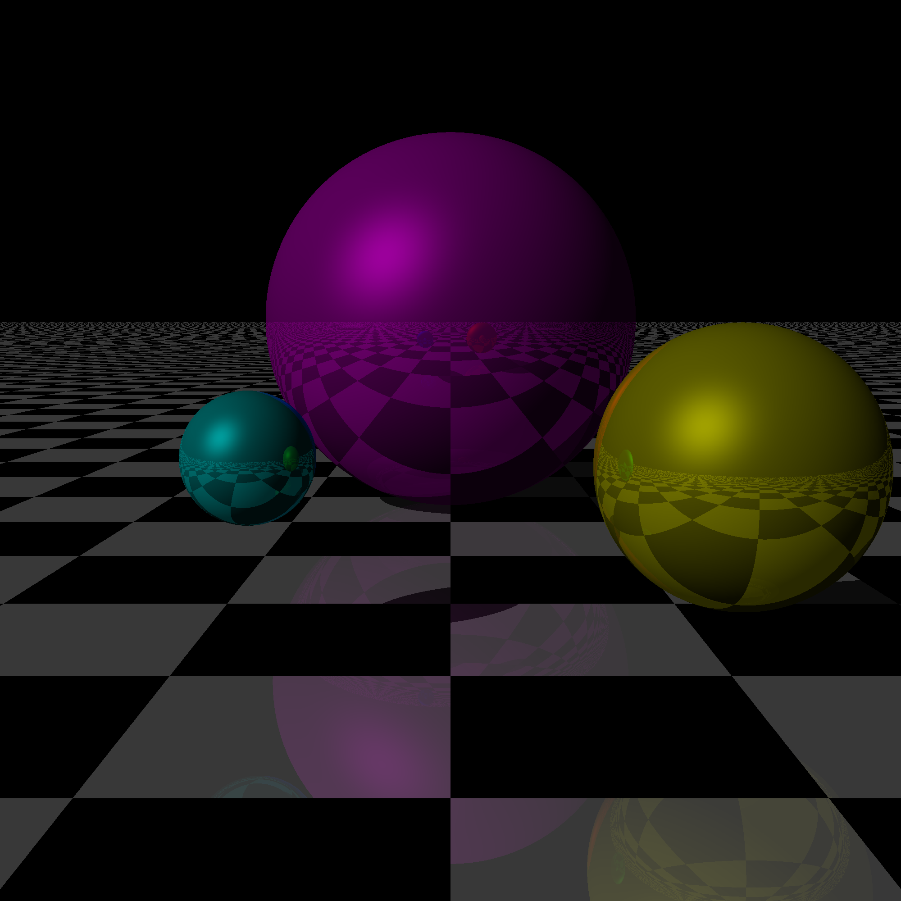

# Pyraytes

Pyraytes is a basic Python ray tracer.

### Helpful ressources

[Ray tracing - Wikipedia](https://en.wikipedia.org/wiki/Ray_tracing_\(graphics\))

[Ray Tracing From Scratch in Python](https://medium.com/swlh/ray-tracing-from-scratch-in-python-41670e6a96f9)

[Scratchapixel](https://www.scratchapixel.com/index.php)