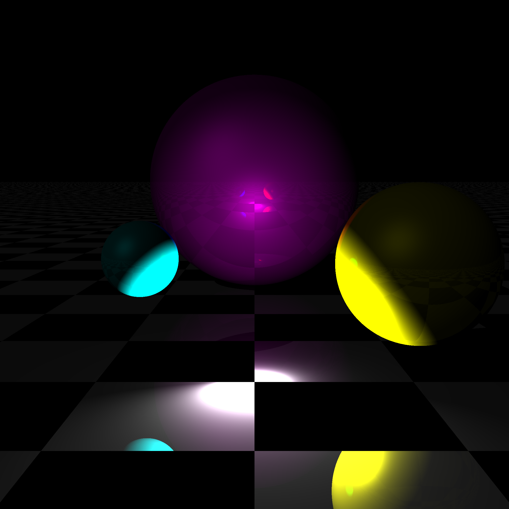

# Pyraytes

Pyraytes is a basic Python ray tracer.

## Samples

<figure>
    
    <figcaption align = "center">
        <b>Fig.1 - Ambient light</b>
    </figcaption>
</figure>

<figure>
    
    <figcaption align = "center">
        <b>Fig.2 - Directional light</b>
    </figcaption>
</figure>

<figure>
    
    <figcaption align = "center">
        <b>Fig.3 - Point light</b>
    </figcaption>
</figure>

<figure>
    
    <figcaption align = "center">
        <b>Fig.4 - Ambient & Directional light</b>
    </figcaption>
</figure>

<figure>
    
    <figcaption align = "center">
        <b>Fig.5 - Ambient & Point light</b>
    </figcaption>
</figure>

<figure>
    
    <figcaption align = "center">
        <b>Fig.6 - Directional & Point light</b>
    </figcaption>
</figure>

## Helpful ressources

[Ray tracing - Wikipedia](https://en.wikipedia.org/wiki/Ray_tracing_\(graphics\))

[Ray Tracing From Scratch in Python](https://medium.com/swlh/ray-tracing-from-scratch-in-python-41670e6a96f9)

[Scratchapixel](https://www.scratchapixel.com/index.php)